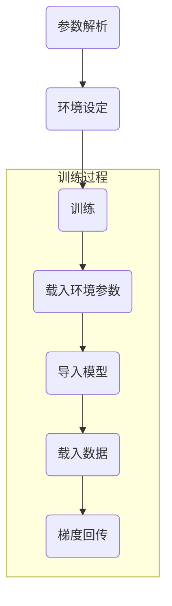

## 各种训练文件之间的差异在于有些是分类器的个数不一样，有些是数据不一样，有些是输出不一样（也就是说针对的是独特的模型结构）。所以，结论就是看着用就行。

### 训练代码流程图



````mermaid
graph LR
A(开始) -->B(起床)
B --天气不好--- C>干活]
C ==> D{休息时间到了}
D -.yes.-> E((休息))
D -.no.-> C
E --> F(吃饭)


